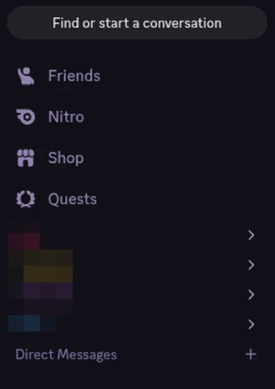
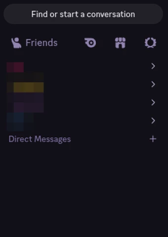

# Cea's Vencord Snippets

> [!WARNING]
> Discord updates may break these snippets at any time.
> Please be patient as I will likely fix it shortly.
> If it remains an issue after a day, open an issue.

## List of Snippets
| Snippet | Description | Preview |
| :-----: | ----------- | :-----: |
| [Compact Sidebar Buttons](CompactSidebarButtons) 
 [Download](raw/main/CompactSidebarButtons/CompactSidebarButtons.css) | Compacts the lesser-used navigation buttons at the top of the sidebar to icons, and fits them beside the Friends button. |  | |

## Installation
> [!NOTE]
> All of these methods yield the same results, so use whatever you are most comfortable with.
> The recommended usage is just the easiest if you are a beginner.

Local Themes (Recommended)

- Right-click the <ins>Download</ins> link and click <ins>Save As</ins>.
- Save the snippet wherever you like.
- Open your Themes folder in Vencord.
 - User Settings > Themes (Vencord category) > Open Themes Folder
- Drag n' Drop the downloaded snippet into the Themes folder.

Online Themes

- Right-click the <ins>Download</ins> link and click <ins>Copy Link</ins>.
- Open your Themes folder in Vencord.
 - User Settings > Themes (Vencord category) > Open Themes Folder.
- Go to the <ins>Online Themes</ins> tab.
- Paste the snippet link into a new line in the textbox.

QuickCSS

- Click the <ins>Download</ins> link.
- Copy all of the contents.
- Open your Themes folder in Vencord.
 - User Settings > Themes (Vencord category) > Open Themes Folder.
- Click on the <ins>Edit QuickCSS</ins> button.
- Paste the snippet code into the QuickCSS editor.

